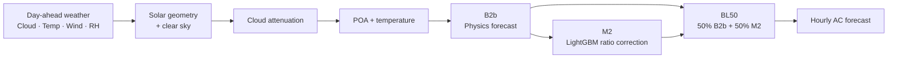
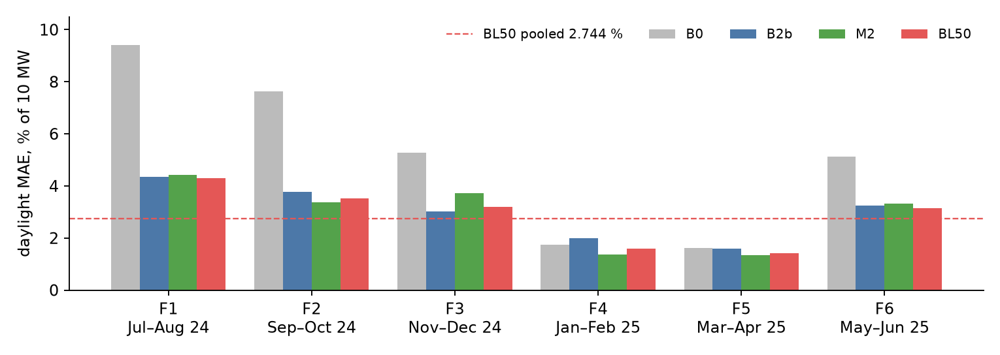

# Day-Ahead Solar Power Forecasting

A physics + machine-learning forecast of next-day hourly AC export for a fixed-tilt PV plant, built from day-ahead weather forecasts only.

| | |
|---|---|
| **Submission** | Ellume take-home |
| **Forecast** | Day-ahead hourly AC export |
| **Plant** | 10 MW AC / 12.5 MWp DC |
| **Location** | Tumakuru, Karnataka |
| **Test period** | 1 Jul – 31 Aug 2025 |
| **Final model** | 50% B2b + 50% M2 (BL50) |

**[Approach note (HTML)](approach_note.html)** · **[Approach note (PDF)](approach_note.pdf)** · **[Submission: `predictions.csv`](predictions.csv)** · [Technical notes](NOTES.md) · [Validation methodology](experiments/README.md)

---

## Key results

### 2.744% daylight MAE

**274.43 kW** on **3,696 daylight hours**, BL50, pooled leakage-safe forward validation (six forward folds, Jul 2024 – Jun 2025).

> **Pooled leakage-safe validation — NOT test-set performance.**

The pooled figure includes the easier dry-season folds. The monsoon folds are harder: BL50 daylight MAE is **4.31%** in F1 (Jul–Aug 2024) and **3.51%** in F2 (Sep–Oct 2024). The Jul–Aug 2025 test period is monsoon and cloudier, so 2.744% should not be read as an expected test score.

### ~4.8% scenario estimate · ~+100 kW bias

The scenario estimate in the approach note reweights leakage-safe validation errors to the test-period cloud mix and gives roughly **4.8% daylight MAE** with about **+100 kW bias** for the **validated raw-target variant**.

> **Scenario estimate — NOT measured test performance.** Test labels were not used.

### +70 kW / +1.8% target-gap diagnostic

The submitted production forecast averages about 70 kW (1.8%) higher than the raw-target diagnostic variant over the 806 test daylight hours.

> **Model-to-model diagnostic — NOT test performance.**

| Model | Daylight MAE | % of 10 MW | Bias |
| --- | ---: | ---: | ---: |
| **BL50 (final)** | **274.43 kW** | **2.744%** | +68.77 kW |
| M2 | 281.62 kW | 2.816% | +48.90 kW |
| B2b | 287.14 kW | 2.871% | +88.64 kW |
| B0 (climatology) | 476.19 kW | 4.762% | +179.57 kW |

<sub>Source: [`experiments/results/model_summary.csv`](experiments/results/model_summary.csv) — pooled DAYLIGHT-VALID rows.</sub>

---

## Contents

- [Architecture](#architecture)
- [Validation integrity](#validation-integrity)
- [Approach note](#approach-note)
- [Submission artifact](#submission-artifact)
- [Reproduce](#reproduce)
- [Validation and diagnostics](#validation-and-diagnostics)
- [Repository structure](#repository-structure)

---

## Architecture



| Stage | Method |
| --- | --- |
| Solar geometry | pvlib solar position |
| Clear sky | Ineichen |
| Cloud attenuation | Fitted clearness curve |
| POA | Erbs + Hay-Davies |
| Temperature | Faiman |
| ML correction (M2) | LightGBM ratio model — 15 leaves, 295 rounds, five seeds averaged |
| Final forecast (BL50) | Equal blend of B2b and M2 |

**Inputs at prediction time:** the timestamp and four day-ahead forecast variables — cloud cover, temperature, wind speed, relative humidity. Measured POA, measured temperatures, rainfall, plant status and AC power are **not** used as prediction-time features ([`src/features.py`](src/features.py)).

The Jul–Aug 2025 monsoon test period is cloudier than Jul–Aug 2024, so forecast cloud-cover error is a major driver of power forecast error.

---

## Validation integrity

> [!IMPORTANT]
> **The earlier 3.87% validation headline is superseded** and is not the final result.
> It was affected by temporal/data leakage: a centered soiling correction used future information, and whole-file preprocessing crossed fold boundaries.

The final validation fixes this:

- strictly forward folds
- preprocessing and fitting limited to each fold's training data
- raw power as the validation target, with no future-dependent soiling correction
- no tuning — the production configuration is reused unchanged
- the test period (Jul–Aug 2025) is not used for any fitting, selection or scoring

Details: [`NOTES.md` → Leakage-safe validation](NOTES.md#leakage-safe-validation) · [experiment methodology](experiments/README.md) · [`experiments/leakage_safe_validation.py`](experiments/leakage_safe_validation.py)



*BL50 daylight MAE across the leakage-safe forward folds.*

---

## Approach note

The approach note is the main write-up. It covers the data audit, cleaning decisions, plant behaviour, physics model, ML correction, the validation leakage investigation, error analysis and limitations.

| | |
|---|---|
| **[Read the approach note (HTML)](approach_note.html)** | Full readable version |
| **[Download PDF](approach_note.pdf)** | Same content, print-ready |
| [NOTES.md](NOTES.md) | Technical and provenance notes |
| [experiments/README.md](experiments/README.md) | Validation experiment methodology |

**Data cleaning in brief:** the audit found mixed timestamp formats, a misplaced block, duplicate and missing hours, an MW-vs-kW logging interval, sentinel values, impossible power spikes, flatlines, and STOP/PARTIAL availability periods. Each is documented with its cleaning decision in the approach note.

---

## Submission artifact

**[`predictions.csv`](predictions.csv)** — the submitted hourly AC power forecast for the test period.

| | |
|---|---|
| Rows | 1,488 (hourly, 1 Jul – 31 Aug 2025) |
| Columns | `timestamp`, `predicted_ac_power_kw` |
| Model | BL50 (50% B2b + 50% M2) |
| Test accuracy | Not reported — test labels are not in the supplied data |
| SHA-256 | `0B4D5965648CBF4A2F6F73782B119DF5519A2615113C32CDCC74A399DD8A7184` |

---

## Reproduce

Windows PowerShell, Python 3.12.10:

```powershell
git clone https://github.com/SiddharthMuneshwar26/ellume-solar-forecasting.git
cd ellume-solar-forecasting
python -m venv .venv
.\.venv\Scripts\Activate.ps1
pip install -r requirements.txt
python run.py
```

`run.py` reads `data/train.csv` and `data/test.csv` and writes `predictions.csv` to the repository root.

<details>
<summary>If PowerShell blocks virtual-environment activation</summary>

Run `Set-ExecutionPolicy -Scope Process RemoteSigned` for the current session, then activate as above. Alternatively, after creating the environment and installing requirements, run `.\.venv\Scripts\python.exe run.py` without activating it.

</details>

---

## Validation and diagnostics

| Artifact | Link |
| --- | --- |
| Leakage-safe validation | [script](experiments/leakage_safe_validation.py) · [methodology](experiments/README.md) |
| Pooled model comparison | [model_summary.csv](experiments/results/model_summary.csv) |
| Per-fold results | [fold_results.csv](experiments/results/fold_results.csv) · [fold_audit.csv](experiments/results/fold_audit.csv) |
| Validation predictions | [validation_predictions.csv](experiments/results/validation_predictions.csv) |
| Target-gap diagnostic | [script](experiments/target_gap.py) · [target_gap.csv](experiments/results/target_gap.csv) |
| Error analysis | [by hour](reports/error_by_hour.csv) · [worst days](reports/worst_days.csv) · [daily errors](reports/daily_errors_monsoon_folds.csv) |
| Walkthrough | [notebooks/walkthrough.ipynb](notebooks/walkthrough.ipynb) |

---

## Repository structure

<details>
<summary>Show file tree</summary>

```text
ellume-solar-forecasting/
├── run.py                      # end-to-end pipeline → predictions.csv
├── predictions.csv             # submission artifact
├── requirements.txt
├── data/
│   ├── train.csv
│   └── test.csv
├── src/
│   ├── __init__.py
│   ├── analysis.py
│   ├── audit.py
│   ├── clean.py
│   ├── features.py
│   ├── solar.py
│   ├── train.py
│   └── validate.py
├── experiments/
│   ├── leakage_safe_validation.py
│   ├── target_gap.py
│   ├── README.md
│   └── results/                # leakage-safe fold outputs + target-gap diagnostic
│       ├── fold_audit.csv
│       ├── fold_results.csv
│       ├── model_summary.csv
│       ├── target_gap.csv
│       └── validation_predictions.csv
├── reports/                    # cleaning, model comparison, error analysis
├── notebooks/                  # walkthrough
├── approach_note_figures/
├── approach_note.html
├── approach_note.pdf
├── NOTES.md
├── PROBLEM.md
└── DATASET.md
```

</details>

---

<sub>Built with Python, pvlib, LightGBM, pandas, NumPy and scikit-learn. Development and review used VS Code and coding/review assistance.</sub>
